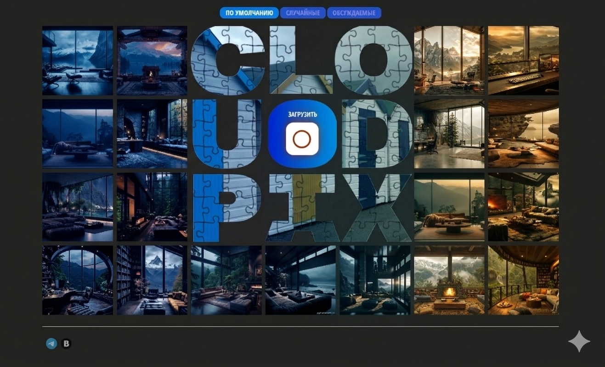

# 📸 CloudPix Platform — Photo Sharing Ecosystem

<p align="center">
  
</p>

<p align="center">
  <strong>A lightweight and high-performance Single Page Application (SPA) for publishing, processing, and filtering user-generated content.</strong>
</p>

---

## 📖 Overview
This project focuses on implementing complex business logic using **Vanilla JavaScript** without heavy frameworks. Special attention is given to modularity and interface performance when handling media data.

---

## 🛠 Tech Stack
| Layer | Technologies |
| :--- | :--- |
| **Core** | JavaScript (ES6+) — Modular Architecture |
| **UI Engine** | HTML5 (Semantic), CSS3 (Flexbox, Grid) |
| **Networking** | Fetch API with reusable request modules |
| **Libraries** | PristineJS (Validation), noUiSlider (Effects) |
| **Build Tool** | Vite |

---

## 🎯 Key Features & Engineering Challenges
* 💎 **Modular Architecture**: The project is divided into independent components (`gallery`, `form`, `editor`, `api`), adhering to the **Single Responsibility** principle.
* ⚡ **Performance Optimization**: Implemented the **Debounce** pattern for photo filtering to minimize DOM re-renders and enhance responsiveness.
* 🛡️ **Validation & Security**: Integrated **Pristine.js** for dynamic hashtag validation (RegExp, duplicate checks) and comment sanitization.
* 📡 **API Layer**: A universal transport layer based on the Fetch API. It uses the [bvtrots-mock-server](https://bvtrots-mock-server.onrender.com/) hosted on **Render** as a backend.
* 🎨 **Interactive UI**: Features complex image scaling logic and a dynamic filter system powered by CSS variables controlled via JS events.

---

## 📂 Project Structure
Based on the architectural design:
```text
cloudpix-platform/
├── css/              # Application styles
├── img/              # Static images & assets
├── js/               # Logic source code
│   ├── filters/      # Content filtering modules
│   ├── show-big-photo/ # Full-screen view logic
│   ├── upload-new-photo/ # Upload form & image editing
│   ├── utils/        # Helpers (API, modals, shared utils)
│   └── main.js       # Entry point
├── index.html        # Main page
└── package.json      # Dependencies & project config
```

---

## ⚙️ Installation & Setup
1. Clone the repository

        git clone https://github.com/bvtrots/cloudpix-platform.git
        cd cloudpix-platform


2. Install dependencies

        npm install


3. Run in development mode

        npm run dev

   [⚠️!IMPORTANT]\
   Note: The application uses a free Render instance for the backend. Free instances spin down after inactivity. On the first launch, it may take 30–60 seconds for the server to "wake up." If data doesn't load immediately, please visit the backend link to trigger the server wake-up.


4. Build for production

        npm run build

---


## 📜 Commit Convention
To maintain a clean and readable history, this project follows a semantic commit convention with emojis:

| Tag | Emoji | Meaning |
| :--- | :--- | :--- |
| **feat** | ✨ | New feature or functionality |
| **fix** | 💊 | Bug fixes and code repairs |
| **refactor** | ♻️ | Code restructuring without changing functionality |
| **style** | 🎨 | UI/UX, CSS, and layout improvements |
| **build** | ⚙️ | Build system configuration or dependencies |
| **chore** | 🔧 | Maintenance, config tweaks, or tool updates |
| **docs** | 📝 | Documentation and comments |

---

## 📝 Engineering Commentary
This project places a strong emphasis on DOM manipulation and asynchronous interaction. The implemented logic for "infinite" rendering and content filtering is designed to maintain stable memory consumption even during long user sessions. The code follows ES-Modules standards, making it highly maintainable and ready for future TypeScript migration.


<p align="center">
Developed with ❤️ by <strong><a href="https://github.com/bvtrots">bvtrots</a></strong>
</p>
